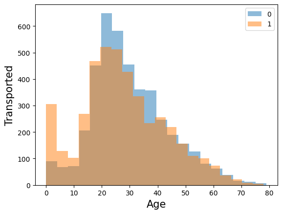
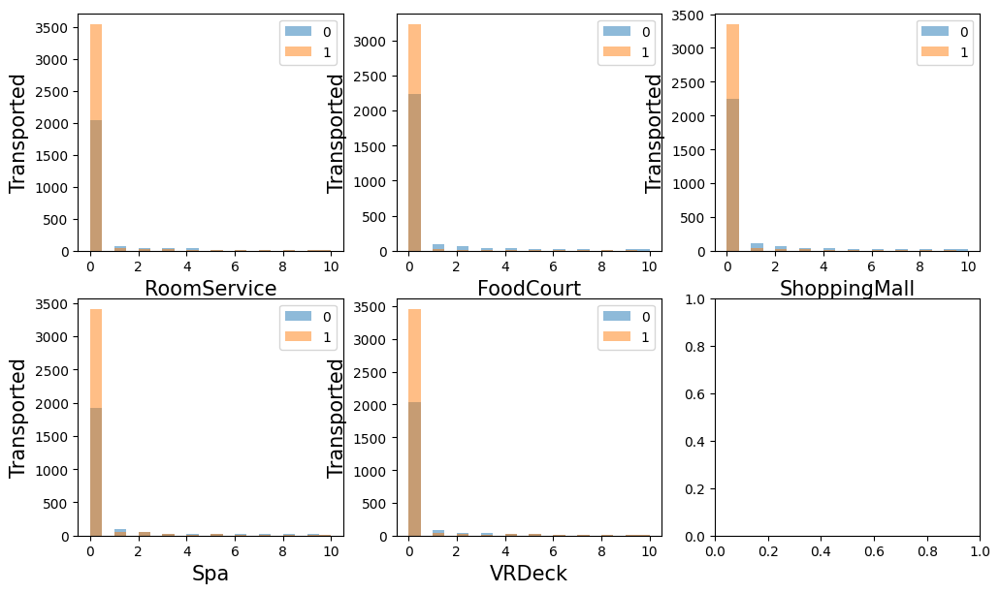
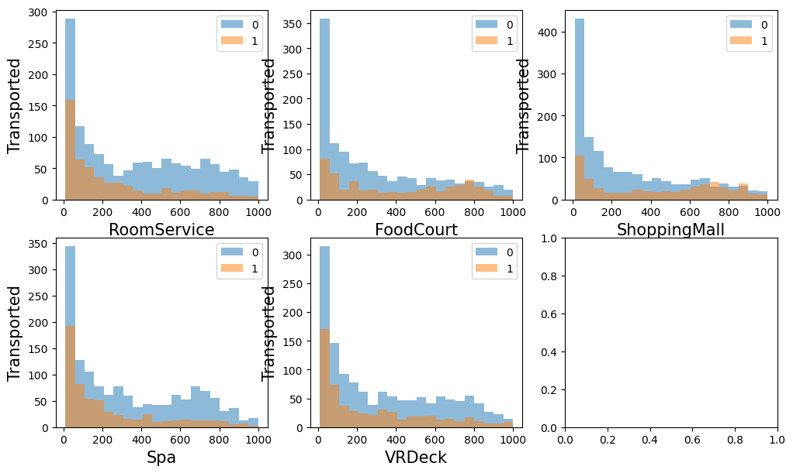
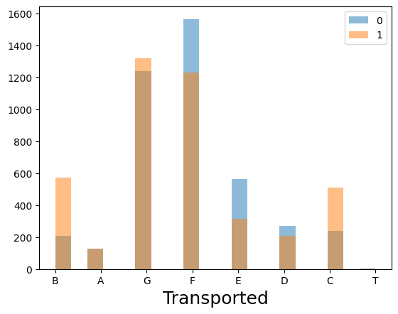
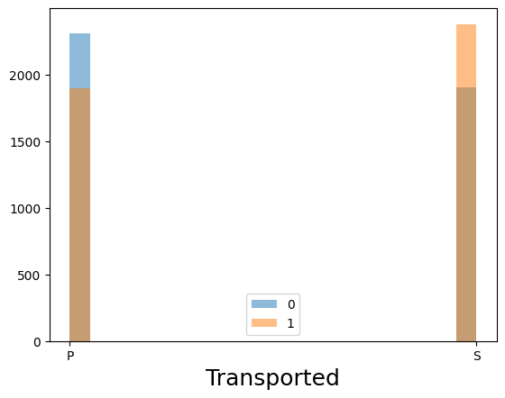
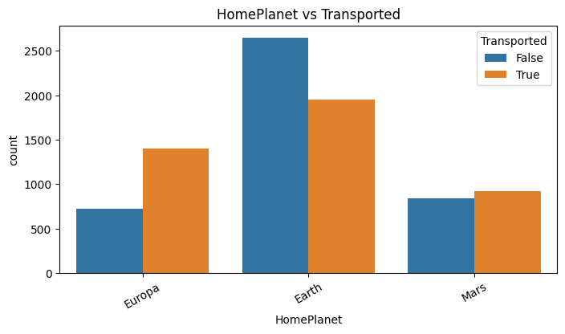

# 分析

## 1. 年齢とラベルとの関係性

* 年齢層前半はTransported，中盤くらいはされていないことが確認できる．

## 2. RoomService等との関係性

* サービスなどにお金を使用したかしていないかを表している．
* 図を参照すると，0円ならば全体を通してTransportedの割合が高く，1円でも使用していればTransportedされていない割合が0円の場合と比較して高い．
* よって，全体を通して金を使用したかを特徴量に加えるべき．

$ X[\text{'usedMoney'}] = X[\text{"RoomService"}] + X[\text{"FoodCourt"}] + X[\text{"ShoppingMall"}] + X[\text{"Spa"}] +X[\text{"VRDeck"}]$

## 3. デッキとの関係性

* デッキのクラス，左右どちらかも合わせて可視化したところ，差が生じていることが判明したため，こちらも併せて特徴量にすることとした．

## 4. 居住地との関係

エウロパと地球は火星に比べてTransportedの差が大きい．この情報と仮死状態かの特徴量を合わせることで何かより良い特徴量の生成につなげることはできないか．